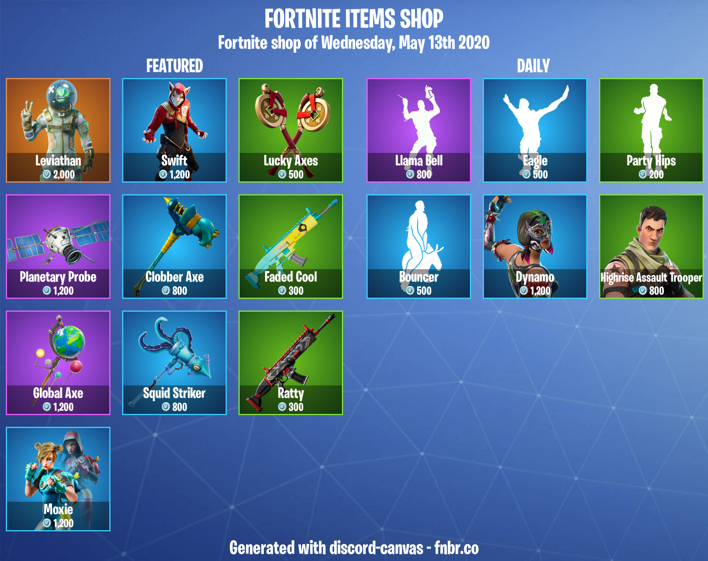

# FortniteShop

## Example

Here is an example of Fortnite's items shop:



```javascript
const canvas = require("discord-canvas"),
  shop = new canvas.FortniteShop();
  
let image = await shop
  .setToken("xxxxxxxx-xxxx-xxxx-xxxx-xxxxxxxxxxxx")
  .toAttachment();

let attachment = new Discord.Attachment(image, "FortniteShop.png");

message.channel.send(attachment);
```


The canvas is saved five days after the first generation for more performance.


## Functions

There is the complete list of available functions

### `.setToken`

Define your [fnbr.co](https://fnbr.co/api/docs) token!


You must have a fnbr api access to use this module!


```javascript
.setToken("xxxxxxxx-xxxx-xxxx-xxxx-xxxxxxxxxxxx")
```

### `.lang` _\(optional\)_

Define the language of date!  
Click [**here** ](https://www.ge.com/digital/documentation/predix-services/c_custom_locale_support.html)for the list of all languages available

```javascript
.lang("en")
```

### `.dateFormat` _\(optional\)_

Define the format of date with **moment**!  
Click [**here** ](https://momentjs.com/docs/#/displaying/format/)for more informations

```javascript
.dateFormat("dddd, MMMM Do YYYY")
```

### `.setText` _\(optional\)_

You can translate or modify the text


You must keep the {date} variable


```javascript
.setText("header", "FORTNITE ITEMS SHOP")
.setText("daily", "DAILY")
.setText("featured", "FEATURED")
.setText("date", "Fortnite shop of {date}")
.setText("footer", "Generated with discord-canvas - fnbr.co")
```

